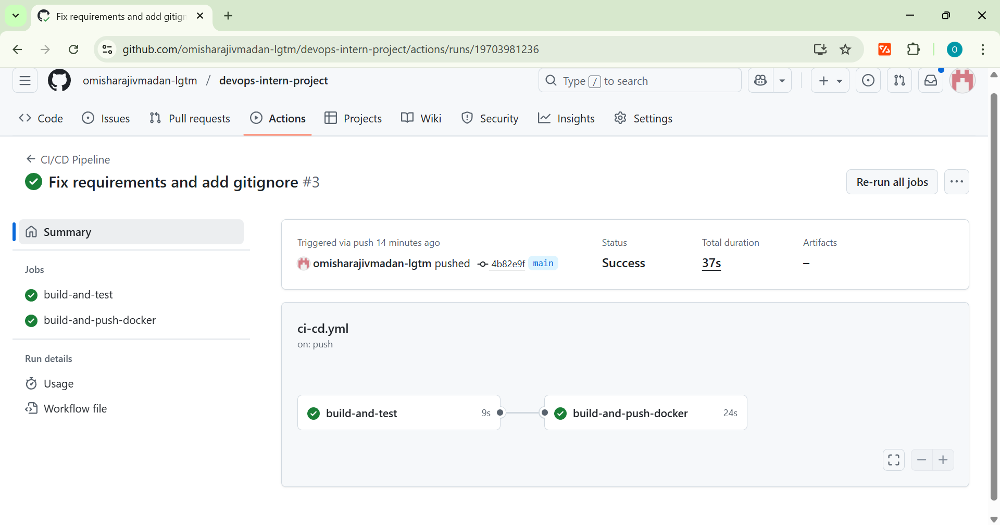
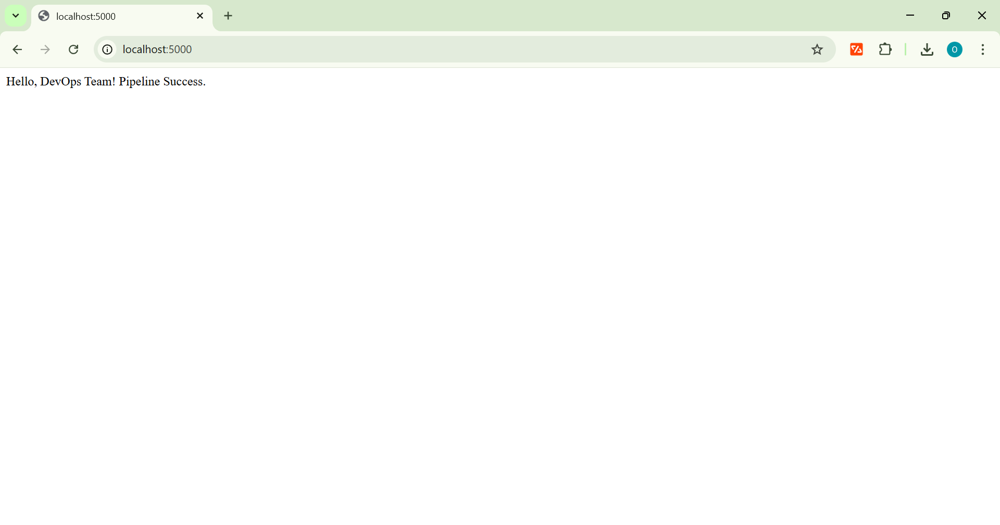

# 🚀 DevOps Internship Task: CI/CD Pipeline Implementation


## 📄 Executive Summary
This project implements a fully automated CI/CD pipeline for a Python Flask application. The goal was to create a "Commit-to-Deploy" workflow where every code change is automatically tested, containerized, and pushed to a registry without human intervention.

Below is a detailed walkthrough of the implementation process, architectural decisions, and final results.

---

## 🛠️ Step 1: Application Development & Testing Strategy
To simulate a real-world scenario, I developed a lightweight web API using **Flask**.

* **Application:** A simple route (`/`) that returns a JSON success message.
* **Testing Strategy:** I implemented unit tests using **Pytest** (`tests/test_app.py`). This ensures that broken code never reaches the containerization stage. If the tests fail, the pipeline stops immediately.

## 🐳 Step 2: Containerization (Docker)
I created a `Dockerfile` to package the application and its dependencies into a portable artifact.

* **Base Image:** I chose `python:3.9-slim` to keep the image size small and secure.
* **Port Exposure:** The container exposes port `5000` to allow external access to the API.
* **Dependency Management:** Dependencies are installed via `requirements.txt` to ensure consistency between development and production environments.

## 🔄 Step 3: CI/CD Pipeline Architecture
I utilized **GitHub Actions** to orchestrate the workflow. The pipeline (`ci-cd.yml`) is triggered on every push to the `main` branch and executes in two distinct jobs:

### Job 1: Build & Test (Continuous Integration)
1.  **Environment Setup:** Spins up an Ubuntu runner and installs Python 3.9.
2.  **Dependency Installation:** Installs Flask and Pytest.
3.  **Automated Testing:** Runs the test suite. **If this fails, the pipeline terminates.**

### Job 2: Build & Push (Continuous Delivery)
* *Condition:* Only runs if "Build & Test" passes.
1.  **Authentication:** securely logs into **Docker Hub** using GitHub Secrets (`DOCKER_USERNAME`, `DOCKER_PASSWORD`).
2.  **Build:** Creates the Docker image from the latest code.
3.  **Push:** Uploads the image to the Docker Hub registry with the `latest` tag.

---

## 📸 Proof of Execution
Here is the visual evidence of the successful implementation.

### 1. Successful Pipeline Execution
The GitHub Actions workflow completed successfully, passing both the Testing and Docker Push stages.



### 2. Local Deployment Verification
After the pipeline finished, I pulled the image from Docker Hub and ran it locally to verify the deployment.



**Command executed:**
```bash
docker run -d -p 5000:5000 omishamadan/devops-intern-project:latest